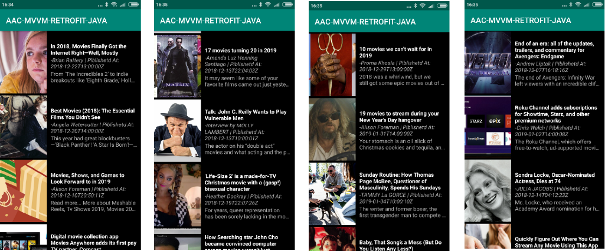

# Android-Architecture-Components-MVVM-Retrofit-JAVA
This repository contains Android Architecture Components ( LiveData , View Model and MVVM with retrofit for consuming rest api ) 

## About This Project

In this project we will build a movies artcle app using android architecture components <B>( LiveData and ViewModel )</B> usning <B>MVVM</B> pattern by the help of [Retrofit](https://square.github.io/retrofit/) for consuming rest api data from [News Api](https://newsapi.org/)

## App Features
* Show list of movies article 

## App demo 

## Library Used
* [Android Architecture Components](https://developer.android.com/topic/libraries/architecture/)
* [Live Data](https://developer.android.com/topic/libraries/architecture/livedata)
* [View Model](https://developer.android.com/topic/libraries/architecture/viewmodel)
* [Retrofit](https://square.github.io/retrofit/)
* [News Api](https://newsapi.org/)
* [Glide](https://github.com/bumptech/glide)
* [Recyclerview](https://developer.android.com/guide/topics/ui/layout/recyclerview)

## Contributing

Anyone can contribute in this project.

## Authors

**Shantu Chandra Dash** 
* [GitHub](https://github.com/shantudas)
* [Facebook](https://www.facebook.com/shantudashbd)
* [Linkedin](https://www.linkedin.com/in/shantudashbd/)

## License

This project is licensed under the MIT License - see the [LICENSE.md](https://github.com/shantudas/Android-Architecture-Components-MVVM-Retrofit-JAVA/blob/master/LICENSE) file for details
